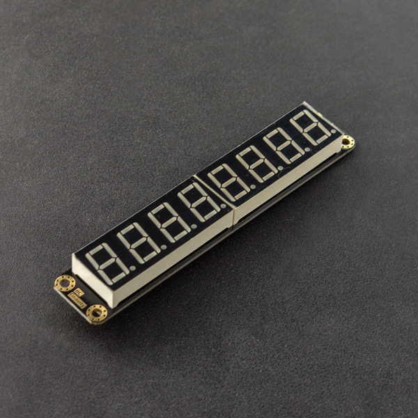

# DFRobot_LedDisplayModule

* [中文版](./README_CN.md)
  
This is a 4bits / 8bits digital tube. It communicates with the host via IIC to show numbers from 0 to 9, capital letters A, B, C, D, E, F, H, L, O, P, U and dash-. <br>
The IIC address of 4 bits digital tube in default is 0x48. <br>
The IIC address of 8 bits digital tube in default is 0xE0. This address can be changed to 0xE2, 0xE4, 0xE6 with different combinations of 2 welding points that in the back of the display. <br>



## Product Link (https://www.dfrobot.com/product-1978.html)
    SKU: DFR0646

  - [Summary](#summary)
  - [Installation](#installation)
  - [Methods](#methods)
  - [Compatibility](#compatibility)
  - [History](#history)
  - [Credits](#credits)

## Summary
This is an Arduino IDE library to help realize the communication between the 4bits/8bits digital tube and Arduino<br>
The library ease the control of display by IIC<br>

## Installation

To use this library, please download the library file first and paste it into the \Arduino\libraries directory, then open the examples folder and run the demo in the folder.

## Methods

```C++
  /**
   * @fn begin
   * @brief  init digital tube
   * @param bit set display digit
   * @return Return 0 if the initialization is successful, otherwise return non-zero
   */
  int begin(eSetBit_t bit);
  
  /**
   * @fn displayOn
   * @brief Turn ON the display
   * @n IIC command to turn ON the display
   * @return None
   */
  void displayOn();
  
  /**
   * @fn displayOff
   * @brief Turn OFF the display 
   * @n IIC command to turn OFF the display
   * @return None
   */  
  void displayOff();

  /**
   * @fn flashTwos
   * @brief Flash mode of the 8 bits digital tube, flash at 0.5Hz
   * @n IIC flash command
   * @return None
   */
  void flashTwos();
  
  /**
   * @fn flashOnes
   * @brief Flash mode of the 8 bits digital tube, flash at 1Hz
   * @n IIC flash command
   * @return None
   */
  void flashOnes();
  
  /**
   * @fn flashHalfs
   * @brief Flash mode of the 8 bits digital tube, flash at 2Hz
   * @n IIC flash command
   * @return None
   */
  void flashHalfs();
  
  /**
   * @fn stopFlash
   * @brief The 8 bits digital tube stops flash 
   * @n IIC command to stop flash
   * @return None
   */
  void stopFlash();

  /**
   * @fn setBrightness
   * @brief Set brightness ofdigital tube
   * @param brightnessValue The brightness value can be set to numbers 1~8
   * @return None
   */
  void setBrightness(int brightnessValue); 

  
  /**
   * @fn setDisplayArea
   * @brief Display area of the digital tube
   * @param areaData Display area from the first bit to the fourth bit could be number 1~4.
   * @return None
   */
  void setDisplayArea(int areaData1 = 82,int areaData2 = 82,int areaData3 = 82,int areaData4 = 82,int areaData5 = 82,int areaData6 = 82,int areaData7 = 82,int areaData8 = 82);
  
  /**
   * @fn print
   * @brief Print data of  digital tube
   * @param sensorData It could be both integer and decimal
   * @return None
   */  
  void print(double sensorData);
  
  /**
   * @fn print
   * @brief Print data of  digital tube
   * @param buf  Displayed data of bit 1 to bit 8 could be the numbers 0 to 9, capital letters A, B, C, D, E, F, H, L, O, P, U and dash-,
   * @n and it also could be decimal points, such as "0." "9." "A." "-."
   * @return None
   */
  void print(const char *buf1 = "82",const char *buf2 = "82",const char *buf3 = "82",const char *buf4 = "82",const char *buf5 = "82",const char *buf6 = "82",const char *buf7 = "82",const char *buf8 = "82");
  
```

## Compatibility

MCU                | Work Well    | Work Wrong   | Untested    | Remarks
------------------ | :----------: | :----------: | :---------: | -----
Arduino Uno        |      √       |              |             | 
Mega2560           |      √       |              |             | 
Leonardo           |      √       |              |             | 
ESP32              |      √       |              |             | 
micro:bit          |      √       |              |             | 

## History

- 2019/12/10 Version V1.0.0 released.
- 2022/03/21 Version V1.0.1 released.

## Credits

Written by Actor (wenzheng.wang@dfrobot.com), 2019. (Welcome to our [website](https://www.dfrobot.com/))


