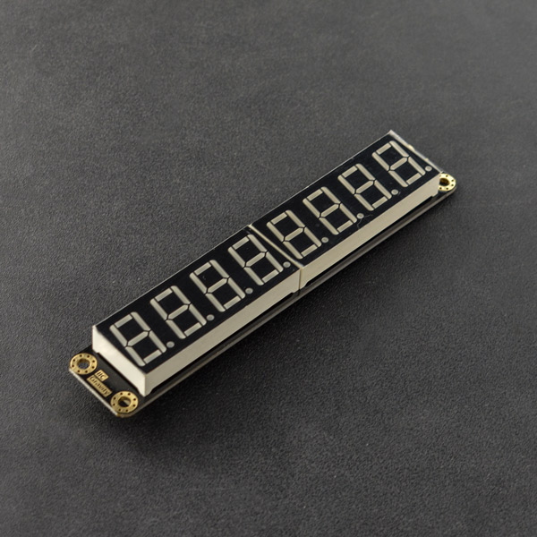
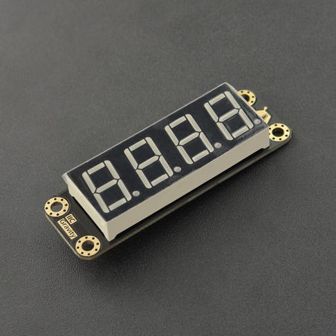

# DFRobot_LedDisplayModule

* [English Version](./README.md)
  
这是一个4位/ 8位数码管。 它通过IIC与主机通信，显示0 ~ 9的数字，大写字母A、B、C、D、E、F、H、L、O、P、U和破折号。   <br>
4位数码管的IIC地址默认为0x48。 <br>
8位数码管的IIC地址默认为0xE0。 该地址可以用显示器背面的2个焊点的不同组合来更改为0xE2、0xE4、0xE6。 <br>




## 产品链接 (https://www.dfrobot.com.cn/goods-2601.html)

    SKU: DFR0646/DFR0645

## 目录
  - [概述](#概述)
  - [库安装](#库安装)
  - [方法](#方法)
  - [兼容性](#兼容性)
  - [版本](#版本)
  - [创作者](#创作者)

## 概述
这是一个Arduino IDE库，帮助实现4位/8位数码管与Arduino之间的通信  
该库简化了IIC对显示的控制  <br>

## 库安装

使用此库前，请首先下载库文件，将其粘贴到\Arduino\libraries目录中，然后打开examples文件夹并在该文件夹中运行演示。
## 方法

```C++
  /**
   * @fn begin
   * @brief  初始化数码管显示
   * @param bit 设置显示位数
   * @return 如果显示0则初始化成功，否则返回非0
   */
  int begin(eSetBit_t bit);
  
  /**
   * @fn displayOn
   * @brief 打开显示
   * @n I2C命令打开显示
   * @return None
   */
  void displayOn();
  
  /**
   * @fn displayOff
   * @brief 关闭显示 
   * @n I2C命令关闭显示
   * @return None
   */  
  void displayOff();

  /**
   * @fn flashTwos
   * @brief 8位数码管的闪光模式，闪光0.5Hz  
   * @n IIC flash 命令
   * @return None
   */
  void flashTwos();
  
  /**
   * @fn flashOnes
   * @brief 8位数码管的闪光模式，闪光1Hz 
   * @n IIC flash 命令
   * @return None
   */
  void flashOnes();
  
  /**
   * @fn flashHalfs
   * @brief 8位数码管的闪光模式，闪光2Hz  
   * @n IIC flash 命令
   * @return None
   */
  void flashHalfs();
  
  /**
   * @fn stopFlash
   * @brief 8位数码管停止闪烁 
   * @n IIC command to stop flash
   * @return None
   */
  void stopFlash();

  /**
   * @fn setBrightness
   * @brief 设置数码管亮度
   * @param brightnessValue 亮度值可设置为数字1~8  
   * @return None
   */
  void setBrightness(int brightnessValue); 
  

  /**
   * @fn setDisplayArea
   * @brief 数码管显示区域设置
   * @param areaData 显示区域从第1位到第8位可以是1~8号  
   * @return None
   */
  void setDisplayArea(int areaData1 = 82,int areaData2 = 82,int areaData3 = 82,int areaData4 = 82,int areaData5 = 82,int areaData6 = 82,int areaData7 = 82,int areaData8 = 82);


  /**
   * @fn print
   * @brief 数码管数据打印
   * @param sensorData 可以是整数和小数
   * @return None
   */
  void print(double sensorData);
  
  /**
   * @fn print
   * @brief 数码管数据打印
   * @param buf 第1位到第8位显示的数据可以是数字0到9，大写字母A、B、C、D、E、F、H、L、O、P、U和破折号，也可以是小数点，如“0”,“9”,“a”,“-”。
   * @return None
   */
    void print(const char *buf1 = "82",const char *buf2 = "82",const char *buf3 = "82",const char *buf4 = "82",const char *buf5 = "82",const char *buf6 = "82",const char *buf7 = "82",const char *buf8 = "82");
```

## 兼容性

MCU                | Work Well    | Work Wrong   | Untested    | Remarks
------------------ | :----------: | :----------: | :---------: | -----
Arduino Uno        |      √       |              |             | 
Mega2560           |      √       |              |             | 
Leonardo           |      √       |              |             | 
ESP32              |      √       |              |             | 
micro:bit          |      √       |              |             | 

## 版本

- 2019/12/10 - V1.0.0版本
- 2022/03/21 - V1.0.1版本

## 创作者

Written by Actor (wenzheng.wang@dfrobot.com), 2019. (Welcome to our [website](https://www.dfrobot.com/))


